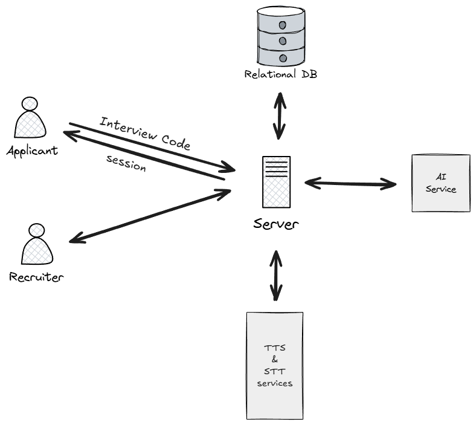

# Candidly — AI Interview Platform

This repository contains the full-stack Candidly application: a React + Vite frontend and a FastAPI backend that together provide automated resume parsing, AI-driven interviews, transcript generation, and recruiter tools.

This project is packaged for local development and demonstration. The codebase includes:
- Frontend: `frontend/` (React + Vite)
- Backend: `backend/` (FastAPI)
- Documentation and scripts to run the system locally

## 📸 Screenshots

### System Architecture


### Landing Page


### Recruiter Dashboard


### Candidate Profile - Clean Interview


### Candidate Profile - Flagged for Security Issues


## Quickstart (development)

Prerequisites:
- Node.js 16+ and npm
- Python 3.10+ and pip

1) Backend setup

```cmd
cd backend
python -m venv .venv
.venv\Scripts\activate
pip install -r requirements.txt
```

Create environment file from the example and update as needed:

```cmd
copy .env.example .env
# Edit .env to set DATABASE_URL, OPENAI_API_KEY (optional), and other settings
```

Run the backend:

```cmd
uvicorn app.main:app --reload
```

API docs will be available at `http://localhost:8000/docs`.

2) Frontend setup

```bash
cd frontend
npm install
npm run dev
```

Open the frontend at `http://localhost:5173` (or the port Vite reports).

3) Run an interview flow

- Create or open a recruitment in the recruiter UI
- Generate or copy the interview code and use it on the applicant flow
- Upload a resume and proceed with the interview

## Preparing for GitHub

- Remove local secrets from `.env` before pushing. Do NOT commit `.env`.
- Add a clear `LICENSE` file if you intend to publish the project.
- Verify `.gitignore` contains `node_modules/`, `.venv/`, and other local artifacts.

## Project structure

```
frontend/    # React + Vite app
backend/     # FastAPI backend
README.md    # This file
```

## Features

### Database Models
- ✅ Recruitment model (id, title, department, location, status, interview_code)
- ✅ Candidate model (personal info, scores, status, flags, timestamps, session management)
- ✅ Interview data (transcript, scores, security flags, question tracking)

### Recruitment API
- ✅ `GET /api/recruitment` - Get active recruitment
- ✅ `POST /api/recruitment` - Create new recruitment
- ✅ `PUT /api/recruitment/{id}` - Update recruitment details
- ✅ `GET /api/recruitment/{id}` - Get specific recruitment
- ✅ `GET /api/recruitment/{id}/stats` - Get recruitment statistics
- ✅ `POST /api/recruitment/regenerate-code/{id}` - Regenerate interview code
- ✅ `DELETE /api/recruitment/{id}` - Delete recruitment

### Candidate API
- ✅ `GET /api/candidates` - List with search/filter/sort
- ✅ `GET /api/candidates/{id}` - Get candidate details
- ✅ `POST /api/candidates` - Create candidate manually
- ✅ `PUT /api/candidates/{id}` - Update candidate
- ✅ `PATCH /api/candidates/{id}/status` - Update status
- ✅ `DELETE /api/candidates/{id}` - Delete candidate
- ✅ `GET /api/candidates/{id}/transcript` - Download interview transcript

### Interview API
- ✅ `POST /api/interview/validate-code` - Verify interview code
- ✅ `POST /api/interview/upload-resume` - Upload and AI-parse resume (Ollama/OpenAI/Regex fallback)
- ✅ `POST /api/interview/start` - Start interview session
- ✅ `POST /api/interview/chat` - Chat with AI interviewer (conversational flow)
- ✅ `POST /api/interview/submit` - Submit interview and get AI evaluation
- ✅ `GET /api/interview/status/{session_token}` - Get interview status
- ✅ `POST /api/interview/update-flags` - Update security flags during interview

### AI Services
- ✅ **Resume Parser**: Extract name, email, phone, location, experience, education, skills from PDF/DOCX
- ✅ **ATS Scoring**: AI-powered resume evaluation against job requirements (0-100 score with strengths/gaps/reasoning)
- ✅ **AI Interviewer**: 
  - Server-managed question progression (opening → technical → coding challenge)
  - Conversational AI with context awareness
  - Speech-to-text input (Web Speech API)
  - Text-to-speech responses (Web Speech Synthesis)
  - Natural dialogue flow with conversation history
- ✅ **Interview Analysis**:
  - Ultra-strict scoring rubric (0-100) with detailed evaluation
  - Sound anomaly detection (background noise/voices)
  - Face detection monitoring (multiple faces)
  - AI-generated response detection
  - Automated candidate summary generation
  - Detailed transcript creation and file export

### Frontend Features
- ✅ Landing page with role selection (Recruiter/Applicant)
- ✅ Recruiter dashboard with candidate listing, search, filter, and sort
- ✅ Candidate detail view with scores, flags, summary, and transcript download
- ✅ Recruitment configuration page
- ✅ Applicant flow: code entry → resume upload → speech-based AI interview
- ✅ Real-time monitoring: camera feed, face detection, audio monitoring
- ✅ Visual indicators for AI speaking and user listening states
- ✅ Session management with secure tokens (no login required)

### Security & Monitoring
- ✅ Client-side face detection (face-api.js)
- ✅ Audio monitoring for background voices
- ✅ Real-time flag updates to backend
- ✅ Security flags persisted in database and displayed to recruiters
- ✅ Session token validation and expiration after interview

### Technology Stack
- ✅ **Frontend**: React 18 + Vite, Tailwind CSS, Lucide icons, face-api.js, Web Speech API
- ✅ **Backend**: FastAPI, SQLAlchemy ORM, Pydantic schemas
- ✅ **Database**: SQLite (production-ready for single recruiter)
- ✅ **AI Providers**: Ollama (phi3, local), OpenAI (fallback), Regex (basic fallback)
- ✅ **File Processing**: PyPDF2 (PDF), python-docx (DOCX)

## Support

For questions or issues, please open a GitHub issue with error details and console output.

## 🗂️ Project Structure

```
Candidly/
├── frontend/                 # React frontend application
│   ├── src/
│   │   ├── pages/
│   │   │   ├── LandingPage.jsx              # Role selection
│   │   │   ├── RecruiterDashboard.jsx       # Main recruiter view
│   │   │   ├── CandidateDetail.jsx          # Candidate profile
│   │   │   ├── RecruitmentConfig.jsx        # Settings page
│   │   │   ├── ApplicantInterview.jsx       # Speech-based AI interview
│   │   │   ├── ApplicantResumeUpload.jsx    # Resume upload
│   │   │   └── ApplicantProfile.jsx         # Code entry
│   │   ├── services/
│   │   │   ├── api.js                       # API client
│   │   │   └── monitoringService.js         # Face/audio monitoring
│   │   ├── App.jsx                           # Router configuration
│   │   └── index.css                         # Tailwind styles
│   └── package.json
│
├── backend/                  # FastAPI backend
│   ├── app/
│   │   ├── models/
│   │   │   ├── candidate.py              # Candidate ORM model
│   │   │   └── recruitment.py            # Recruitment ORM model
│   │   ├── schemas/
│   │   │   ├── candidate.py              # Candidate Pydantic schemas
│   │   │   ├── interview.py              # Interview Pydantic schemas
│   │   │   └── recruitment.py            # Recruitment Pydantic schemas
│   │   ├── routers/
│   │   │   ├── candidates.py             # Candidate API endpoints
│   │   │   ├── interview.py              # Interview API endpoints
│   │   │   └── recruitment.py            # Recruitment API endpoints
│   │   ├── services/
│   │   │   ├── ai_service.py             # Unified AI service (Ollama/OpenAI)
│   │   │   ├── resume_parser.py          # PDF/DOCX parsing
│   │   │   └── interview_analyzer.py     # Interview evaluation
│   │   ├── database.py                    # SQLAlchemy setup
│   │   └── main.py                        # FastAPI app entry
│   ├── requirements.txt
│   └── transcripts/                       # Saved interview transcripts
│
└── README.md
```

## 🚦 Getting Started

### Prerequisites
- **Ollama** (recommended for local AI): Install from [ollama.ai](https://ollama.ai) and run `ollama pull phi3`
- **Node.js 16+** and npm
- **Python 3.10+** and pip

### Backend Setup
```cmd
cd backend
python -m venv .venv
.venv\Scripts\activate
pip install -r requirements.txt
```

Create `.env` file:
```cmd
copy .env.example .env
```

Edit `.env` and configure:
- `DATABASE_URL=sqlite:///./candidly.db` (default)
- `OPENAI_API_KEY=your_key_here` (optional, fallback only)

Run backend:
```cmd
uvicorn app.main:app --reload
```

Backend will be available at `http://localhost:8000` (API docs at `/docs`)

### Frontend Setup
```bash
cd frontend
npm install
npm run dev
```

Frontend will run on `http://localhost:5173`

## 🔐 Session Management

### Candidate Sessions
- **Session Token**: Secure token generated after resume upload with valid interview code
- **Storage**: Browser sessionStorage (cleared on tab close)
- **Validation**: Token verified on each API call during interview
- **Flow**: 
  1. Enter interview code → Backend validates against active recruitment
  2. Upload resume → AI parsing + ATS scoring → Session token generated
  3. Token stored in browser and sent with all interview API requests
  4. Token invalidated after interview submission
  5. Candidate cannot restart interview (prevents cheating)

### Recruiters
- No authentication required (single-recruiter use case)
- Direct access to dashboard and all candidate data

## 🎨 Design & UX

### Color Palette (Tailwind CSS)
- **Primary Purple**: `primary-400` to `primary-600` (#a855f7 to #7c3aed)
- **Dark Theme**: `dark-950` to `dark-800` (#0a0a0f to #1a1a24)
- **Status Colors**:
  - 🟢 Green: Interviewed
  - 🔵 Blue: Shortlisted  
  - 🟡 Yellow: New
  - 🟣 Purple: Offered
  - 🔴 Red: Rejected

### Key UX Features
- **Speech-Based Interview**: Candidates speak naturally, AI responds via text-to-speech
- **Visual Feedback**: Real-time indicators for AI speaking / user listening / ready to speak
- **Security Monitoring**: Live camera feed with face detection and audio analysis
- **Minimal Friction**: No login required for candidates, single interview code entry
- **Recruiter Dashboard**: Quick overview with search, filter, sort, and detailed candidate profiles

## 📝 API Examples

### Upload Resume
```bash
POST /api/interview/upload-resume
Content-Type: multipart/form-data

Response:
{
  "candidate_id": 1,
  "session_token": "abc123...",
  "candidate_name": "John Doe",
  "message": "Resume uploaded successfully"
}
```

### Start Interview
```bash
POST /api/interview/start
{
  "session_token": "abc123..."
}

Response:
{
  "candidate_id": 1,
  "candidate_name": "John Doe",
  "message": "Interview session started",
  "greeting": "Hello John Doe. I'll be conducting your interview for the Senior Developer role..."
}
```

### Chat with AI
```bash
POST /api/interview/chat
{
  "session_token": "abc123...",
  "message": "I have 5 years of experience...",
  "conversation_history": [...]
}

Response:
{
  "reply": "That's good experience. Can you describe a specific system you built?"
}
```

### Submit Interview
```bash
POST /api/interview/submit
{
  "session_token": "abc123...",
  "responses": [
    {"role": "ai", "content": "...", "timestamp": "..."},
    {"role": "user", "content": "...", "timestamp": "..."}
  ]
}

Response:
{
  "message": "Interview submitted successfully",
  "candidate_id": 1,
  "interview_score": 72,
  "summary": "Candidate demonstrated solid technical knowledge..."
}
```

